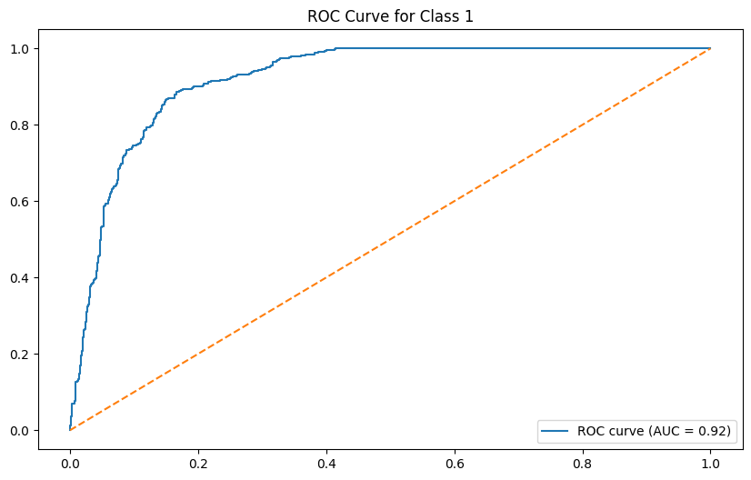
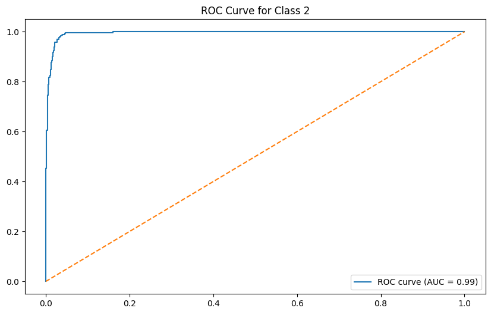
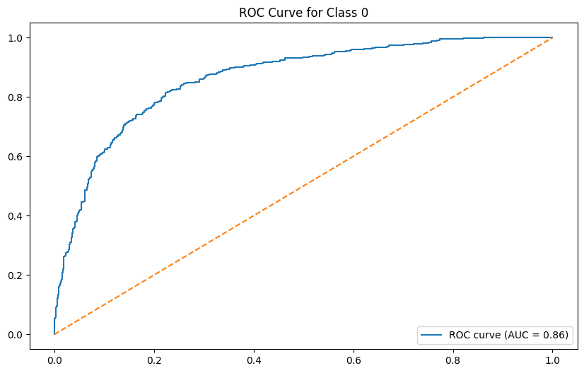
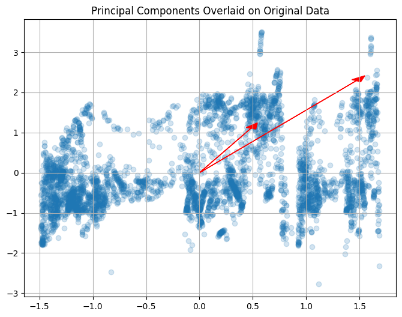
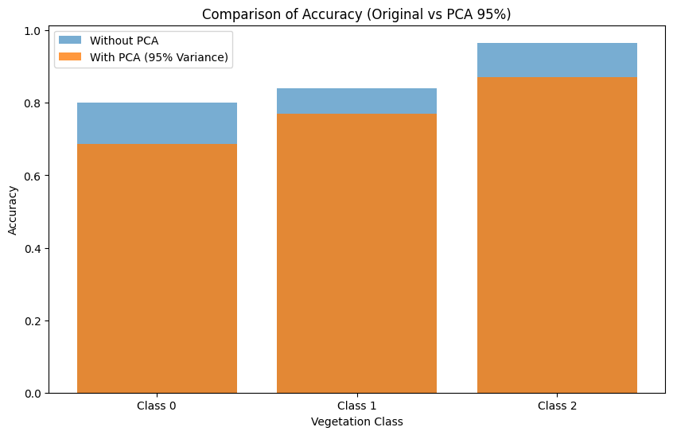
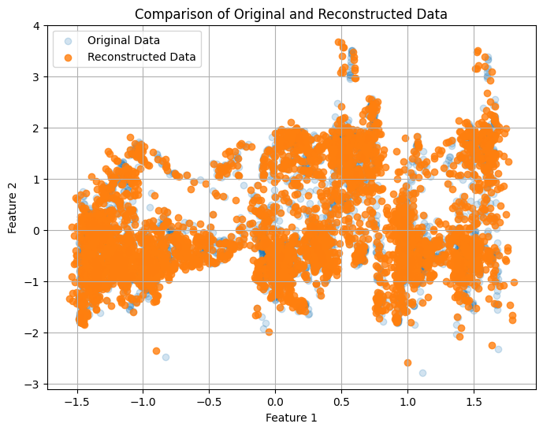
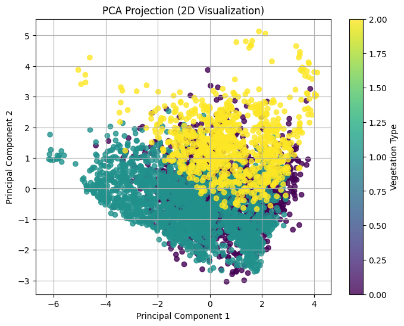

# ENTREGA FINAL

## 5 Learning a non-linear function

## Análise dos Resultados - Aprendizagem de Função Não-Linear (Logistic GAM com Splines)

### 5.1. **Curvas ROC e AUC (Área sob a Curva)**
As curvas ROC para as três classes mostram o desempenho do modelo em termos de **sensibilidade (True Positive Rate - TPR)** vs **1-Especificidade (False Positive Rate - FPR)**.  

#### **Classe 0 (AUC = 0.86)**
- A curva ROC para a Classe 0 apresenta uma **área sob a curva (AUC) de 0.86**.  
- Embora o desempenho seja aceitável, há uma margem de erro maior para esta classe em comparação com as demais.  
- A curva está um pouco afastada do canto superior esquerdo, indicando que o modelo tem **alguma dificuldade em distinguir corretamente esta classe** dos restantes. 



#### **Classe 1 (AUC = 0.92)**
- A curva ROC para a Classe 1 exibe uma AUC de **0.92**, o que reflete um desempenho bastante sólido.  
- A proximidade da curva ao canto superior esquerdo sugere que o modelo **classifica bem esta classe, minimizando falsos positivos e falsos negativos**.  



#### **Classe 2 (AUC = 0.99)**
- A curva ROC para a Classe 2 indica uma AUC de **0.99**, demonstrando **excelente performance** para esta classe.  
- A curva praticamente toca o eixo superior, sugerindo que o modelo **classifica quase perfeitamente os exemplos desta classe**.  



### 5.2. **Accuracy e Relatórios de Classificação**  
Os relatórios de classificação fornecem detalhes sobre a **precisão (precision)**, **recall (sensibilidade)** e **F1-score** para cada classe.  

#### **Classe 0:**
- **Accuracy:** 80.93%  
- **F1-score (Sem PCA):** 0.87  
- **Recall:** 90%  
- **MCC (Matthews Correlation Coefficient):** 0.5452  
- O modelo tem **algumas dificuldades com a Classe 0**, refletido por um MCC mais baixo e recall menor.  

#### **Classe 1:**
- **Accuracy:** 85.28%  
- **F1-score:** 0.85  
- **Recall:** 89%  
- **MCC:** 0.7097  
- O desempenho para a Classe 1 é **equilibrado** entre precisão e recall, indicando um **modelo consistente para esta classe**.  

#### **Classe 2:**
- **Accuracy:** 96.91%  
- **F1-score:** 0.97  
- **Recall:** 94%  
- **MCC:** 0.9135  
- A Classe 2 é claramente a melhor classificada, com um F1-score elevado e um MCC próximo de 1, indicando uma **correlação quase perfeita**.  


### 5.3. **Interpretação das Curvas ROC e Accuracy Geral**  
- **Classe 2 obteve o melhor desempenho**, tanto em termos de Accuracy quanto de AUC (0.99).  
- **Classe 0 apresenta o desempenho mais fraco**, com AUC de 0.86 e MCC relativamente baixo (0.5452). Isso sugere que o modelo tem dificuldades em distinguir corretamente exemplos desta classe.  
- **Classe 1 mantém um equilíbrio sólido** com uma AUC de 0.92 e Accuracy consistente.  


### 5.4. **Validação Cruzada e Melhor Modelo**  
Durante a validação cruzada (K-Fold com 5 divisões), o modelo alcançou a seguinte performance:  
- **Classe 0:** Accuracy média inferior em relação às outras classes.  
- **Classe 1:** Resultados consistentes, com boa generalização.  
- **Classe 2:** Obteve a **melhor Accuracy durante a validação cruzada (80.60%)**.  

**Conclusão:** O **melhor modelo é o da Classe 2**, com uma performance bastante estável e quase perfeita.

---

## 6 Decision Trees and Random Forest


Para as decision trees e random forest, numa primeira instância, foi pedido o mesmo tipo de análise.  

Usar as imagens de **decision tree_1** para o primeiro modelo e **decision tree all attributes** para o segundo.  

---

## 6. Decision Trees e Random Forest

### 6.1. Decision Tree  

#### 6.1.1. Construção do Modelo de Classificação  

Foi testado um modelo **sem atributos extra** para a construção da primeira decision tree.  

#### **Resultados Obtidos**  

- **Accuracy:** `89.24%`  
- **Train Accuracy:** `100%`  

#### **Relatório de Classificação**  

| Class      | Precision | Recall | F1-Score | Support |
|------------|------------|--------|----------|---------|
| **0**      | 0.86       | 0.82   | 0.84     | 421     |
| **1**      | 0.90       | 0.93   | 0.91     | 584     |
| **2**      | 0.94       | 0.93   | 0.94     | 259     |
|            |            |        |          |         |
| **Accuracy**  |         |        | 0.89     | 1264    |
| **Macro Avg** | 0.90    | 0.89   | 0.89     | 1264    |
| **Weighted Avg** | 0.89 | 0.89   | 0.89     | 1264    |


#### **Confusion Matrix**  

|             |  | | |
|-------------|-----------|-----------|-----------|
|   | 344       | 62        | 15        |
|   | 41        | 542       | 1         |
|   | 17        | 0         | 242       |


#### **Métricas de Erro**  

- **Error Rate:** `10.76%`  
- **Mean Squared Error (MSE):** `0.1835`  
- **Mean Absolute Error (MAE):** `0.1329`  
- **Root Mean Squared Error (RMSE):** `0.4284`  
- **Log Loss:** `3.8781`  
- **ROC AUC:** `0.9173`  


#### **Análise**  

- O modelo apresenta uma **Accuracy elevada** perante o dataset.  
- **Train Accuracy de 100%** indica **overfitting**, pois há uma grande diferença entre treino e teste.  
- O erro é **baixo**.  
- A **classe 2** tem a melhor performance de classificação.  


### 6.1.2. Grid Search para Encontrar Melhores Atributos  

Foi utilizado o método de **Grid Search** para encontrar os melhores valores para o modelo de decision tree.  

**Melhores Parâmetros Encontrados:**  
```json
{
 'ccp_alpha': 0.0,
 'criterion': 'entropy',
 'max_depth': None,
 'max_leaf_nodes': None,
 'min_samples_leaf': 1,
 'min_samples_split': 2,
 'splitter': 'best'
}
```

### 6.1.3. Utilização dos Atributos Resultantes do Grid Search  

#### **Resultados do Modelo (Após Grid Search):**  

- **Accuracy:** `89.48%`  
- **Train Accuracy:** `95.73%`  

### **Relatório de Classificação**  

| Class      | Precision | Recall | F1-Score | Support |
|------------|------------|--------|----------|---------|
| **0**      | 0.91       | 0.76   | 0.83     | 421     |
| **1**      | 0.87       | 0.96   | 0.91     | 584     |
| **2**      | 0.93       | 0.97   | 0.95     | 259     |
|            |            |        |          |         |
| **Accuracy**  |         |        | 0.89     | 1264    |
| **Macro Avg** | 0.91    | 0.90   | 0.90     | 1264    |
| **Weighted Avg** | 0.90 | 0.89   | 0.89     | 1264    |

### **Confusion Matrix**  

|             |  | |  |
|-------------|-----------|-----------|-----------|
|   | 318       | 85        | 18        |
|   | 23        | 561       | 0         |
|   | 7         | 0         | 252       |


### **Métricas de Erro**  

- **Error Rate:** `10.52%`  
- **Mean Squared Error (MSE):** `0.1646`  
- **Mean Absolute Error (MAE):** `0.1250`  
- **Root Mean Squared Error (RMSE):** `0.4057`  
- **Log Loss:** `1.5110`  
- **ROC AUC:** `0.9427`  


### **Análise do Modelo Ajustado**  

- **Accuracy manteve-se estável** em relação ao modelo anterior.  
- O modelo apresentou **redução de overfitting**, embora ainda exista, mas em um nível muito menor.  
- Em termos de **F1-score e precisão**, o modelo mostrou **melhora em comparação com o primeiro teste**.  
- **Classes 1 e 2** tiveram um **desempenho significativamente melhor** após o ajuste, com uma clara redução de erro.  
- **Menores valores de erro** (MSE, MAE, RMSE).  
- O modelo apresentou **melhores resultados de ROC AUC e Log Loss**, indicando maior capacidade de discriminação.  

### **Conclusão**  

O modelo de **Decision Trees**, após a aplicação de atributos corretos via Grid Search, **melhorou significativamente** em termos de desempenho e robustez. A redução do overfitting permite uma análise mais precisa e uma maior generalização sobre novos dados.  

**Nota:**  
Para a análise de **Random Forest**, utilizar:  
- **Imagem 1:** *random_forest_1* (modelo inicial).  
- **Imagem 2:** *random_forest_all_attributes* (modelo com todos os atributos).  


### 6.2. Random Forest  


### 6.2.1. Construção do Modelo de Classificação  

O modelo Random Forest foi utilizado para diferenciar as classes e construir uma árvore de decisão robusta.  

### **Resultados do Modelo:**  

- **Accuracy:** `92.17%`  
- **Train Accuracy:** `100%`  

### **Relatório de Classificação**  

| Class      | Precision | Recall | F1-Score | Support |
|------------|------------|--------|----------|---------|
| **0**      | 0.94       | 0.81   | 0.87     | 421     |
| **1**      | 0.90       | 0.98   | 0.93     | 584     |
| **2**      | 0.95       | 0.97   | 0.96     | 259     |
|            |            |        |          |         |
| **Accuracy**  |         |        | 0.92     | 1264    |
| **Macro Avg** | 0.93    | 0.92   | 0.92     | 1264    |
| **Weighted Avg** | 0.92 | 0.92   | 0.92     | 1264    |


### **Confusion Matrix**  

|             |  |  |  |
|-------------|-----------|-----------|-----------|
|  | 343       | 66        | 12        |
|   | 14        | 570       | 0         |
|   | 7         | 0         | 252       |


### **Métricas de Erro**  

- **Error Rate:** `7.83%`  
- **Mean Squared Error (MSE):** `0.1234`  
- **Mean Absolute Error (MAE):** `0.0934`  
- **Root Mean Squared Error (RMSE):** `0.3513`  
- **Log Loss:** `0.2630`  
- **ROC AUC:** `0.9827`  


### **Análise do Modelo**  

- O modelo apresenta uma **alta Accuracy de 92%**, o que demonstra uma excelente capacidade de classificação.  
- **Train Accuracy de 100%** indica **overfitting**, sugerindo que o modelo se ajustou excessivamente aos dados de treino.  
- **Precision, recall e F1-score** são particularmente elevados para a **classe 2**, indicando que esta classe é classificada com maior precisão do que as demais.  
- A **classe 0** é a mais prejudicada, apresentando uma menor taxa de recall, refletindo maior dificuldade do modelo em classificá-la corretamente.  
- A **Confusion Matrix** revela que a maioria dos erros ocorre na classe 0, enquanto as classes 1 e 2 apresentam uma taxa de erro reduzida.  
- **Log Loss e ROC AUC** têm valores **bastante positivos**, indicando que o modelo é confiável e possui uma forte capacidade de separação entre as classes.  
- O modelo mantém um **baixo nível de erro**, reforçando sua eficácia em termos de previsão.  

**Conclusão:**  
O modelo Random Forest demonstra uma **excelente performance geral**, mas o overfitting é um ponto de atenção que pode ser abordado através de ajustes adicionais, como regularização ou redução da profundidade das árvores.  

### 6.2.2. Utilização de Grid Search para Otimização do Modelo  

### **Objetivo:**  
Aplicar o **Grid Search** para encontrar os melhores hiperparâmetros para o modelo de **Random Forest**, maximizando a performance e reduzindo o overfitting.  

### **Melhores Parâmetros Encontrados (Grid Search):**  
```json
{
  'class_weight': None,
  'criterion': 'entropy',
  'max_depth': None,
  'max_features': None,
  'max_leaf_nodes': None,
  'min_samples_leaf': 2,
  'min_samples_split': 2,
  'n_estimators': 100,
  'random_state': 42,
  'verbose': 0
}
```


### 6.2.3. Aplicação dos Atributos Resultantes do Grid Search  

### **Resultados do Modelo Após Grid Search:**  

- **Accuracy:** `92.41%`  
- **Train Accuracy:** `97.96%`  

### **Relatório de Classificação**  

| Class      | Precision | Recall | F1-Score | Support |
|------------|------------|--------|----------|---------|
| **0**      | 0.95       | 0.81   | 0.88     | 421     |
| **1**      | 0.90       | 0.98   | 0.94     | 584     |
| **2**      | 0.94       | 0.99   | 0.97     | 259     |
|            |            |        |          |         |
| **Accuracy**  |         |        | 0.92     | 1264    |
| **Macro Avg** | 0.93    | 0.93   | 0.93     | 1264    |
| **Weighted Avg** | 0.93 | 0.92   | 0.92     | 1264    |

### **Confusion Matrix**  

|             |  |  |  |
|-------------|-----------|-----------|-----------|
|   | 342       | 64        | 15        |
|   | 14        | 570       | 0         |
|   | 3         | 0         | 256       |

### **Métricas de Erro e Desempenho**  

- **Error Rate:** `7.59%`  
- **Mean Squared Error (MSE):** `0.1187`  
- **Mean Absolute Error (MAE):** `0.0902`  
- **Root Mean Squared Error (RMSE):** `0.3445`  
- **Log Loss:** `0.2346`  
- **ROC AUC:** `0.9797`  

### **Análise do Modelo**  

- **Accuracy Melhorada:** O modelo obteve uma leve **melhoria na Accuracy** após a aplicação do Grid Search.  
- **Redução do Overfitting:** O **train accuracy** caiu de 100% para aproximadamente 98%, indicando **menos overfitting** em comparação com o modelo anterior.  
- **Desempenho Equilibrado:** As métricas de **precision, recall e F1-score** são **consistentes** entre as classes, com o **modelo 2** apresentando uma vantagem, embora sutil.  
- **Classe 0 com Menor Melhoria:** A **classe 0** continua a apresentar um desempenho ligeiramente inferior em relação às classes 1 e 2, conforme mostrado na **Confusion Matrix**.  
- **Melhoria Significativa nas Classes 1 e 2:** As **classes 1 e 2** beneficiaram-se mais dos ajustes do modelo, com melhorias notáveis nas taxas de recall e precisão.  
- **Redução do Erro:** Os valores de **Log Loss e ROC AUC** são superiores no modelo 2, indicando uma melhor capacidade de discriminação e um menor erro geral.  

### **Conclusão**  

A aplicação do **Grid Search** resultou em um modelo de **melhor performance geral**. Embora o ganho de Accuracy seja modesto, a **redução do overfitting e a melhoria das métricas de erro** tornam o modelo mais robusto e confiável.  

Dessa forma, o modelo com **os atributos ajustados** demonstra ser **mais adequado para uso prático**, equilibrando precisão e generalização, e proporcionando resultados mais consistentes sem comprometer a capacidade de classificação.  

### 6.2.4. Atributos Mais Importantes (Random Forest)  

### **Lista de Atributos Ordenados por Importância**  

Abaixo estão listadas as features que apresentaram maior relevância no modelo, ordenadas de forma decrescente.  

| Atributo                               | Importância |
|---------------------------------------|--------------|
| **Altitude**                           | 0.6299       |
| **Id**                                 | 0.1407       |
| **Horizontal_Distance_To_Roadways**    | 0.0565       |
| **Horizontal_Distance_To_Fire_Points** | 0.0469       |
| **Horizontal_Distance_To_Water**       | 0.0341       |
| **Slope_Orientation**                  | 0.0211       |
| **Shadow_Index_12h**                   | 0.0208       |
| **Shadow_Index_9h**                    | 0.0188       |
| **Shadow_Index_15h**                   | 0.0121       |
| **Slope**                              | 0.0097       |
| **Wind_Exposure_Level**                | 0.0094       |


### 6.2.5. Correlação com Análises Anteriores  

### **Correlação de Atributos (Task 2):**  

| Atributo                               | Correlação |
|---------------------------------------|------------|
| **Altitude**                           | 0.47       |
| **Id**                                 | 0.24       |
| **Horizontal_Distance_To_Roadways**    | 0.10       |
| **Horizontal_Distance_To_Fire_Points** | 0.08       |
| **Horizontal_Distance_To_Water**       | 0.08       |
| **Slope_Orientation**                  | 0.00       |
| **Shadow_Index_12h**                   | 0.06       |
| **Shadow_Index_9h**                    | 0.06       |
| **Shadow_Index_15h**                   | 0.07       |
| **Slope**                              | 0.05       |
| **Wind_Exposure_Level**                | 0.01       |

### **Atributos Eliminados (Task 4):**  

Durante a análise da Task 4, foram eliminadas as seguintes features devido à baixa correlação com a variável alvo:  

- **CANOPY_DENSITY**  
- **RAINFALL_SUMMER**  
- **RAINFALL_WINTER**  
- **VERTICAL_DISTANCE_TO_WATER**  
- **SOIL_TYPE**  
- **WILDERNESS_AREA**  

### **Análise Comparativa (Task 2 vs Task 4):**  

- **Task 2:** Identificou várias features com correlação baixa (< 0.1), sugerindo que poderiam ser eliminadas para simplificar o modelo.  
- **Task 4:** Ao eliminar essas features, foi constatado que a performance do modelo **não melhorou significativamente**.  

### **Conclusão:**  

- A análise de **Random Forest** demonstra que algumas features com **baixa correlação (Task 2)** ainda apresentam **importância no processo de classificação**.  
- **Altitude** continua sendo o fator de maior relevância em todas as análises, contribuindo significativamente para a performance do modelo.  
- Embora a eliminação de algumas features pareça lógica pela baixa correlação, **a importância delas no modelo** mostra que elas podem contribuir indiretamente para a separação de classes.  
- A construção de árvores (Random Forest) parece **captar relações não lineares e interações complexas** entre features, o que justifica a presença de atributos com correlação baixa mas importância elevada.  

---

## 7 Support Vector Machine (SVM)

### **Introdução ao SVM**  

Os **Support Vector Machines (SVMs)** são modelos de **Machine Learning** amplamente utilizados para **regressão e classificação**.  
O objetivo principal do SVM é encontrar o **melhor plano de decisão (hiperplano)** que separa diferentes pontos de dados em distintas classes.  
Os SVMs são particularmente eficazes em **espaços de alta dimensão**, onde outros algoritmos podem ter dificuldades em identificar separações lineares.  

### **Como Funciona o SVM Classifier (SVC)?**  

O **SVM Classifier (SVC)** busca o **hiperplano que maximiza a margem** entre duas classes de dados.  
- A **margem** é a distância entre o hiperplano e o ponto de dados mais próximo de cada classe.  
- Estes pontos próximos são chamados de **Support Vectors**, pois influenciam diretamente a posição do limite de decisão.  

### **Análise de SVM (Support Vector Machines)**  

#### **Objetivo do Trabalho**  

O objetivo desta análise foi testar e comparar diferentes **kernels** do **SVM Classifier (SVC)**, avaliando o desempenho de cada um nas tarefas de classificação.  


#### **Testes Realizados**  

Foram testados quatro tipos de **kernels**:  

1. **Linear:**  
   - Ideal para datasets com **muitas features** em relação ao número de amostras.  
   - Eficiente quando os dados são **linearmente separáveis**.  

2. **RBF (Radial Basis Function):**  
   - Aplicado em **problemas não lineares**.  
   - É o **kernel padrão** do SVC devido à sua flexibilidade.  

3. **Poly (Polinomial):**  
   - Usado quando há uma **relação polinomial** nas features do dataset.  

4. **Sigmoid:**  
   - Relacionado com redes neurais e distribuições de dados **sigmoidais**.  


### **Resultados por Kernel**  

#### **1. Kernel Linear**  

- **Accuracy:** `80.38%`  

| Métrica                       | Valor  |
|------------------------------|--------|
| **MSE (Mean Squared Error):** | 0.2983 |
| **MAE (Mean Absolute Error):**| 0.2302 |
| **RMSE (Root Mean Squared Error):**| 0.5461 |

**Relatório de Classificação:**  

| Class | Precision | Recall | F1-Score | Support |
|-------|------------|--------|----------|---------|
| **0** | 0.77       | 0.59   | 0.67     | 424     |
| **1** | 0.77       | 0.90   | 0.83     | 569     |
| **2** | 0.92       | 0.93   | 0.92     | 271     |

**Confusion Matrix:**  
|             |  |  |  |
|-------------|-----------|-----------|-----------|
|   | 251       | 150        | 23        |
|   | 55        | 514       | 0         |
|   | 20         | 0         | 251       |

#### **2. Kernel RBF**  

- **Accuracy:** `76.74%`  

| Métrica                       | Valor  |
|------------------------------|--------|
| **MSE:**                     | 0.3536 |
| **MAE:**                     | 0.2729 |
| **RMSE:**                    | 0.5947 |

**Relatório de Classificação:**  

| Class | Precision | Recall | F1-Score | Support |
|-------|------------|--------|----------|---------|
| **0** | 0.75       | 0.46   | 0.57     | 424     |
| **1** | 0.72       | 0.93   | 0.81     | 569     |
| **2** | 0.89       | 0.92   | 0.91     | 271     |

**Confusion Matrix:**  
|             |  |  |  |
|-------------|-----------|-----------|-----------|
|   | 194       | 200        | 30        |
|   | 42        | 527       | 0         |
|   | 21         | 1         | 249       |

#### **3. Kernel Polinomial (Poly)**  

- **Accuracy:** `72.71%`  

| Métrica                       | Valor  |
|------------------------------|--------|
| **MSE:**                     | 0.4082 |
| **MAE:**                     | 0.3180 |
| **RMSE:**                    | 0.6389 |

**Relatório de Classificação:**  

| Class | Precision | Recall | F1-Score | Support |
|-------|------------|--------|----------|---------|
| **0** | 0.75       | 0.32   | 0.45     | 424     |
| **1** | 0.67       | 0.96   | 0.79     | 569     |
| **2** | 0.87       | 0.89   | 0.88     | 271     |

**Confusion Matrix:**  
|             |  |  |  |
|-------------|-----------|-----------|-----------|
|   | 135       | 253        | 36        |
|   | 25        | 544       | 0         |
|   | 21         | 10         | 240       |

#### **4. Kernel Sigmoid**  

- **Accuracy:** `48.66%`  

| Métrica                       | Valor  |
|------------------------------|--------|
| **MSE:**                     | 0.7152 |
| **MAE:**                     | 0.5807 |
| **RMSE:**                    | 0.8457 |

**Relatório de Classificação:**  

| Class | Precision | Recall | F1-Score | Support |
|-------|------------|--------|----------|---------|
| **0** | 0.48       | 0.51   | 0.49     | 424     |
| **1** | 0.50       | 0.70   | 0.58     | 569     |
| **2** | 0.00       | 0.00   | 0.00     | 271     |

**Confusion Matrix:**  
|             |  |  |  |
|-------------|-----------|-----------|-----------|
|   | 218       | 192        | 14        |
|   | 169        | 397       | 3         |
|   | 71         | 200         | 0       |

### **Análise Comparativa**  

- **Melhor Desempenho Geral:**  
  - O **kernel linear** obteve a maior Accuracy (`80.38%`) e apresentou resultados equilibrados nas classes.  
  - O **kernel RBF** apresentou boa performance nas classes 1 e 2, mas falhou na classe 0.  

- **Kernel Polinomial:**  
  - Embora tenha uma Accuracy aceitável (`72.71%`), apresentou **dificuldades significativas** na classe 0.  

- **Kernel Sigmoid:**  
  - O pior desempenho (`48.66%`), com um F1-score **nulo para a classe 2**.  
  - Não foi capaz de classificar adequadamente a maioria das amostras.  


### **Conclusão**  

- O **kernel linear** foi o mais consistente, apresentando o melhor equilíbrio entre precisão e recall.  
- O **kernel RBF** mostrou potencial, mas exigiria ajustes adicionais para melhorar a classificação da classe 0.  
- O **kernel sigmoid** não é recomendado para este dataset devido ao seu fraco desempenho.  

### 7.2. Utilização de Grid Search para Otimização dos Parâmetros de Cada Kernel 

Para encontrar os **melhores parâmetros** de cada kernel do SVM, foi utilizado o método de **Grid Search**.  

#### **Código - Implementação do Grid Search**  

```python
# Inicialização do modelo SVM com kernel especificado
svm = SVC(kernel=kernel, random_state=42)

# Definir o grid de parâmetros para o GridSearchCV
        param_grid = {
            'C': [0.1, 1],
            'degree': [2, 3, 4],
            'gamma': ['scale', 'auto', 0.01],
            'coef0': [0.0, 0.1, 1.0],
            'shrinking': [True, False],
            'probability': [True, False],
            'tol': [0.001, 0.1],
            'cache_size': [200, 500],
            'class_weight': [None, 'balanced'],
            'verbose': [False],
            'max_iter': [2000],
            'decision_function_shape': ['ovr', 'ovo'],
            'break_ties': [True, False]
        }
        
        # Perform GridSearchCV to find the best parameters
        grid_search = GridSearchCV(svm, param_grid, cv=3, verbose=1, n_jobs=-1)
        grid_search.fit(X_train, y_train)
```

## **Seleção dos Melhores Estimadores (Best Estimator)**  

Após realizar o **Grid Search** para cada kernel, foram obtidos os **melhores parâmetros** para otimizar o desempenho do modelo SVM.  

### **Justificação do Processo:**  
- **Objetivo:** Encontrar a melhor combinação de parâmetros para cada kernel.  
- **Limitações Técnicas:**  
  - Devido a restrições de computação, foram escolhidos **2 a 3 valores por atributo** no `param_grid`.  
  - Máquinas com menor poder computacional não conseguem lidar com **procuras acima de 40-50 mil combinações**.  
- **Cross-Validation:**  
  - Foi utilizada uma **cross-validation (cv)** de **3 folds** em vez de 5 ou 10 para reduzir o tempo de execução.  
- **Resultados:**  
  - Embora limitado, o processo gerou **resultados significativos e úteis** para análise.  

### **Resultados do Grid Search - Melhores Parâmetros por Kernel:**  

- **Kernel Linear:**  
```json
{
  'C': 0.1, 
  'break_ties': False, 
  'cache_size': 200, 
  'class_weight': None, 
  'coef0': 0.0, 
  'decision_function_shape': 'ovr', 
  'degree': 2, 
  'gamma': 'scale', 
  'max_iter': 1000, 
  'probability': True, 
  'shrinking': True, 
  'tol': 0.001, 
  'verbose': False
}
```

- **Kernel RBF:**

```json
{
  'C': 1, 
  'break_ties': False, 
  'cache_size': 200, 
  'class_weight': None, 
  'coef0': 0.0, 
  'decision_function_shape': 'ovr', 
  'degree': 2, 
  'gamma': 'scale', 
  'max_iter': 2000, 
  'probability': True, 
  'shrinking': True, 
  'tol': 0.1, 
  'verbose': False
}
```

- **Kernel Poly:**
```json
{
  'C': 1, 
  'break_ties': False, 
  'cache_size': 200, 
  'class_weight': 'balanced', 
  'coef0': 1.0, 
  'decision_function_shape': 'ovr', 
  'degree': 4, 
  'gamma': 'scale', 
  'max_iter': 2000, 
  'probability': True, 
  'shrinking': True, 
  'tol': 0.1, 
  'verbose': False
}
```

- **Kernel Sigmoid:**
```json
{
  'C': 0.1, 
  'break_ties': True, 
  'cache_size': 200, 
  'class_weight': None, 
  'coef0': 0.0, 
  'decision_function_shape': 'ovr', 
  'degree': 2, 
  'gamma': 'auto', 
  'max_iter': 2000, 
  'probability': True, 
  'shrinking': True, 
  'tol': 0.001, 
  'verbose': False
}

```

### 7.3. Análise dos Resultados e Conclusões  

Após a aplicação dos melhores parâmetros encontrados para cada kernel, foi possível construir um modelo otimizado, proporcionando a melhor performance possível.  

#### **Resultados Obtidos:**  

#### **Kernel Linear:**  

- **Accuracy:** 70.02%  
- **Mean Squared Error (MSE):** 0.5419  
- **Mean Absolute Error (MAE):** 0.3805  
- **Root Mean Squared Error (RMSE):** 0.7362  


#### **Classification Report (Kernel Linear):**  

| Class | Precision | Recall | F1-Score | Support |  
|-------|------------|--------|----------|---------|  
| 0     | 0.57       | 0.50   | 0.53     | 424     |  
| 1     | 0.72       | 0.83   | 0.77     | 569     |  
| 2     | 0.84       | 0.74   | 0.79     | 271     |  
|       |            |        |          |         |  
| **Accuracy** |         |        | **0.70** | **1264** |  
| **Macro Avg** | 0.71   | 0.69   | 0.70     | 1264     |  
| **Weighted Avg** | 0.70 | 0.70   | 0.69     | 1264     |  


#### **Confusion Matrix (Kernel Linear):**  

|                | |  |  |  
|----------------|--------------|--------------|--------------|  
|   | 210          | 175          | 39           |  
|    | 95           | 474          | 0            |  
|    | 63           | 7            | 201          |  


#### **Kernel RBF:**  

- **Accuracy:** 76.74%  
- **Mean Squared Error (MSE):** 0.3513  
- **Mean Absolute Error (MAE):** 0.2722  
- **Root Mean Squared Error (RMSE):** 0.5927  

## **Resultados: Kernel Polinomial (Poly)**  

### **Classification Report:**  

| Class | Precision | Recall | F1-Score | Support |  
|-------|------------|--------|----------|---------|  
| **0** | 0.76       | 0.46   | 0.57     | 424     |  
| **1** | 0.72       | 0.93   | 0.81     | 569     |  
| **2** | 0.89       | 0.92   | 0.91     | 271     |  
|       |            |        |          |         |  
| **Accuracy** |         |        | **0.77** | **1264** |  
| **Macro Avg** | 0.79   | 0.77   | 0.76     | 1264     |  
| **Weighted Avg** | 0.77 | 0.77   | 0.75     | 1264     |  


### **Confusion Matrix:**  

|                | **Predito 0** | **Predito 1** | **Predito 2** |  
|----------------|--------------|--------------|--------------|  
| **Classe 0**   | 194          | 200          | 30           |  
| **Classe 1**   | 42           | 527          | 0            |  
| **Classe 2**   | 20           | 2            | 249          |  


### **Métricas de Erro:**  

- **Accuracy:** 66.77%  
- **Mean Squared Error (MSE):** 0.3964  
- **Mean Absolute Error (MAE):** 0.3536  
- **Root Mean Squared Error (RMSE):** 0.6296  

## **Resultados: Kernel Sigmoide (Sigmoid)**  


### **Classification Report:**  

| Class | Precision | Recall | F1-Score | Support |  
|-------|------------|--------|----------|---------|  
| **0** | 0.50       | 0.68   | 0.58     | 424     |  
| **1** | 0.72       | 0.51   | 0.59     | 569     |  
| **2** | 0.92       | 0.99   | 0.95     | 271     |  
|       |            |        |          |         |  
| **Accuracy** |         |        | **0.67** | **1264** |  
| **Macro Avg** | 0.71   | 0.72   | 0.71     | 1264     |  
| **Weighted Avg** | 0.69 | 0.67   | 0.67     | 1264     |  

### **Confusion Matrix:**  

|                |  |  |  |  
|----------------|--------------|--------------|--------------|  
|    | 289          | 112          | 23           |  
|    | 281          | 288          | 0            |  
|    | 4            | 0            | 267          |  

### **Métricas de Erro:**  

- **Accuracy:** 45.02%  
- **Mean Squared Error (MSE):** 0.5498  
- **Mean Absolute Error (MAE):** 0.5498  
- **Root Mean Squared Error (RMSE):** 0.7415  

## **Resultados: Kernel Sigmoide (Atributos Adicionados)**  


### **Classification Report:**  

| Class | Precision | Recall | F1-Score | Support |  
|-------|------------|--------|----------|---------|  
| **0** | 0.00       | 0.00   | 0.00     | 424     |  
| **1** | 0.45       | 1.00   | 0.62     | 569     |  
| **2** | 0.00       | 0.00   | 0.00     | 271     |  
|       |            |        |          |         |  
| **Accuracy** |         |        | **0.45** | **1264** |  
| **Macro Avg** | 0.15   | 0.33   | 0.21     | 1264     |  
| **Weighted Avg** | 0.20 | 0.45   | 0.28     | 1264     |  


### **Confusion Matrix:**  

|                |  |  |  |  
|----------------|--------------|--------------|--------------|  
|   | 0            | 424          | 0            |  
|    | 0            | 569          | 0            |  
|    | 0            | 271          | 0            |  


### **Análise e Conclusões:**  

1. **Dificuldade na Classificação da Classe 0 e Classe 2:**  
   - A **Classe 0 e a Classe 2 apresentam resultados de classificação nulos**. O modelo **não foi capaz de identificar corretamente nenhuma amostra dessas classes**.  
   - O **F1-score para ambas as classes é 0**, destacando a completa ausência de previsões corretas.  

2. **Desempenho na Classe 1:**  
   - O modelo demonstra **eficiência apenas na Classe 1**, com um **recall de 100% e um F1-score de 0.62**.  
   - Isso indica que o modelo **classifica tudo como Classe 1**, resultando em uma elevada taxa de recall, mas à custa de precisão em outras classes.  

3. **Accuracy Geral:**  
   - A Accuracy geral do modelo é de **45%**, refletindo uma **performance limitada** no conjunto de dados.  
   - O modelo tem uma forte tendência para **predizer a Classe 1 independentemente da entrada**, sugerindo **grande desequilíbrio nas previsões**.  

### **Possíveis Melhorias:**  
- **Aumento do Grid Search:**  
  - Expandir o número de valores testados no Grid Search pode ajudar a encontrar **parâmetros mais precisos e ajustados ao dataset**.  
  - A **inclusão de mais valores para `C`, `gamma` e `degree`** pode melhorar a capacidade do modelo de generalizar melhor entre classes.  

---

Aqui está uma análise detalhada do output do PCA e dos gráficos gerados, seguindo a estrutura que forneceste:

---

## 8 Principal Component Analysis (PCA)

### 8.1. **Análise da Variância Explicada (Gráfico 1 - Curva de Variância Acumulada)**  
A aplicação do PCA resultou na retenção de **9 componentes principais**, explicando aproximadamente **97,4% da variância** do dataset.  

```
--- PCA (95% Variance Retained) ---
Explained variance by each component: [0.29818094 0.13920792 0.12971062 0.1060591  0.09073974 0.06939578
 0.0606098  0.0432807  0.03682966]
Cumulative explained variance: [0.29818094 0.43738886 0.56709948 0.67315858 0.76389832 0.83329411
 0.89390391 0.93718461 0.97401427]
Number of components chosen: 9
```

O gráfico de variância acumulada mostra um crescimento rápido nas primeiras componentes, atingindo cerca de **89% da variância explicada com 6 componentes**. Após esse ponto, o crescimento desacelera, indicando **diminuição nos ganhos marginais de variância com componentes adicionais**.  


Essa tendência sugere que **as primeiras componentes capturam a maior parte da variabilidade dos dados**, apontando para a presença de **alta redundância nas features originais**.  

A necessidade de 9 componentes para atingir 97,4% da variância revela que, embora existam **redundâncias**, o dataset possui **alguma complexidade subjacente**, exigindo múltiplas direções para uma boa representação dos dados.  

---

### 8.2. **Visualização das Componentes Principais (Gráfico 2 - Componentes Principais Sobrepostos aos Dados Originais)**  
O gráfico apresenta uma **projeção em 2D das componentes principais** sobre os dados originais. As setas vermelhas indicam as direções das duas principais componentes do PCA.  



A orientação destas componentes segue as direções de **maior dispersão dos dados**, confirmando que o PCA identificou **as direções de maior variabilidade**.  

Esta visualização evidencia que o PCA está a captar **as estruturas mais relevantes do dataset**. Componentes principais que se alinham bem com os dados sugerem que **a redução dimensional retém as principais características dos dados originais**.  

---

### 8.3. **Comparação de Accuracy (Gráfico 3 - Modelo Original vs PCA)**  
A comparação entre os modelos treinados com e sem PCA mostra uma **redução significativa na Accuracy** após a aplicação do PCA.  

- **Classe 0:**  
  - **Sem PCA:** 80,06%  
  - **Com PCA (95%):** 68,59%  
  - **Perda de Accuracy:** 11,47%  

- **Classe 1:**  
  - **Sem PCA:** 84,02%  
  - **Com PCA (95%):** 76,90%  
  - **Perda de Accuracy:** 7,12%  

- **Classe 2:**  
  - **Sem PCA:** 93,68%  
  - **Com PCA (95%):** 87,18%  
  - **Perda de Accuracy:** 6,50%  



A análise revela que:  
- A **Classe 0** foi a mais afetada pela redução dimensional, indicando que **componentes importantes foram eliminados ou subestimados** pelo PCA.  
- A **Classe 2** manteve uma alta precisão, sugerindo que **esta classe possui uma separabilidade mais clara** que não depende fortemente de todas as features.  

---

### 8.4. **Reconstrução de Dados (Gráfico 4 - Dados Originais vs Reconstruídos)**  
O gráfico de reconstrução ilustra a comparação entre os **dados originais (azul)** e os **dados reconstruídos após o PCA (laranja)**.  

A reconstrução é **consistente na maioria dos pontos**, mas há **pequenos desvios** que indicam **perda de detalhes**. Esses desvios podem explicar a queda na performance do modelo após a aplicação do PCA.  



A reconstrução demonstra que, embora a maior parte da estrutura dos dados tenha sido preservada, **algumas nuances e variações locais foram perdidas** durante o processo de redução dimensional.  

---

### 8.5. **Projeção PCA em 2D (Gráfico 5 - Visualização em 2D)**  
A projeção em 2D exibe a separação das classes após a aplicação do PCA. As cores indicam os diferentes tipos de vegetação.  



O gráfico sugere que, apesar de uma certa **sobreposição entre classes**, existe uma separabilidade razoável para a **Classe 2 (amarelo)**. As **Classes 0 e 1** apresentam mais interseção, o que pode ter contribuído para a diminuição do desempenho do modelo.  

---

### 8.6. **Relatórios de Classificação (Classification Report e F1-score)**  
Os relatórios de classificação fornecem uma análise detalhada por classe:  

- **Classe 0:**  
  - **F1-score sem PCA:** 0,86  
  - **F1-score com PCA:** 0,80  
  - **Recall caiu de 89% para 68%**, indicando que o modelo falhou em identificar corretamente uma parte significativa das amostras após o PCA.  

- **Classe 1:**  
  - **F1-score sem PCA:** 0,84  
  - **F1-score com PCA:** 0,77  

- **Classe 2:**  
  - **F1-score sem PCA:** 0,94  
  - **F1-score com PCA:** 0,87  

A **Classe 0** foi a mais prejudicada, refletindo a maior queda de recall. Esse comportamento sugere que o PCA **eliminou componentes críticos** para a classificação desta classe.  

---

### Interpretação Final e Conclusões  
A aplicação do PCA reduziu a dimensionalidade do dataset para **9 componentes principais**, retendo **97,4% da variância total**.  

Contudo, essa redução levou a uma **queda de performance generalizada** nas classificações, com a Classe 0 sendo a mais impactada.  

A Classe 2 manteve uma performance sólida, indicando que esta **classe possui maior separabilidade e menor dependência de múltiplas features**.  

A reconstrução dos dados e as visualizações 2D confirmam que **a maior parte da informação estrutural foi preservada**, mas **alguns detalhes importantes foram perdidos**.  

---

## 9 Reinforcement Learning (RL)

Reinforcement Learning (RL) é um tipo de machine learning onde o agente aprende através de modelos, criando decisões ao interagir com o ambiente. Ao contrário da aprendizagem não supervisionada, RL permite que o agente aprenda com as consequências das suas ações, por meio de exploração, recebendo feedback em forma de **recompensa** ou **penalidade**.  

### **Principais Conceitos de RL:**  

- **Agente:**  
  - O responsável por aprender e tomar decisões. Pode ser, por exemplo, um jogador que executa movimentos ou interage com o ambiente.  

- **Ambiente:**  
  - O espaço onde o agente opera, contendo estados, ações, recompensas e penalidades.  

- **Estado (S):**  
  - Representação do ambiente em um determinado instante.  

- **Ação (A):**  
  - Possibilidades de escolha do agente em determinados estados do ambiente.  

- **Recompensa (R):**  
  - Valor que o agente recebe após executar uma ação, podendo ser positivo ou negativo.  

- **Política (π):**  
  - Estratégia utilizada pelo agente para selecionar ações.  

- **Função de Valor (V):**  
  - Função que estima a recompensa acumulativa que o agente pode receber a partir de um estado.  

- **Q-Valor (Q):**  
  - Avalia o valor de executar uma ação específica em um determinado estado.  

- **Exploração vs Exploração:**  
  - **Exploração:** O agente tenta descobrir novos caminhos ou estratégias.  
  - **Explotação:** O agente escolhe ações que maximizam recompensas conhecidas, mesmo que o risco seja maior.  


### **Etapas do Processo de Reinforcement Learning:**  

1. **Inicialização:**  
   - O agente começa em um estado inicial, com valores neutros, randomizados ou um objetivo indefinido.  

2. **Interação:**  
   - O agente executa ações no ambiente, movimenta-se e interage com o mundo apresentado.  

3. **Aprendizagem:**  
   - Após cada ação, o agente aprende, interpretando as recompensas (positivas ou negativas) que recebe.  

4. **Terminação:**  
   - O processo termina quando o agente atinge o objetivo ou falha no tempo estabelecido.  


### **Algoritmo Escolhido: Q-learning**  

O algoritmo escolhido para o dataset foi o **Q-learning**. Através da exploração dos algoritmos disponíveis e da análise do dataset, este mostrou-se o mais adequado.  


#### **Funcionamento no Dataset:**  

1. **Classe de Seleção de Características:**  
   - O próprio dataset define as características escolhidas.  
   - Os estados são representados por arrays binários, indicando se uma característica foi selecionada ou não.  
   - As ações envolvem a adição ou remoção de características.  
   - As recompensas estão diretamente ligadas ao **nível de Accuracy do modelo** utilizado.  

2. **Classe de Aprendizagem do Agente:**  
   - Implementa o agente de Q-learning.  
   - O agente aprende uma **Q-table** que decide as características a serem escolhidas.  
   - Utiliza a abordagem **ε-greedy** para balancear exploração e explotação.  

3. **Loop de Treinamento:**  
   - O agente é treinado durante um número pré-determinado de episódios.  
   - O **Q-Valor** é atualizado automaticamente com base nas ações e recompensas atribuídas.  


#### **Modelos Utilizados no Dataset:**  

Dois modelos foram implementados para aplicar o Q-learning:  
- **Random Forest** (com todos os atributos).  
- **Support Vector Machine Classifier (SVM)** com kernel **RBF** (com todos os atributos).  

Ambos os modelos mostraram-se eficazes durante o processo de aprendizagem.  


### **Resultados e Análise:**  

Os resultados do Q-learning podem ser visualizados no arquivo **"R_learning.png"**.  

- **Análise do Gráfico:**  
  - Na maioria dos episódios, as ações do agente resultaram em recompensas positivas.  
  - O **Q-Valor atinge frequentemente o máximo de 50**, indicando que o agente aprende de forma progressiva, selecionando características mais apropriadas.  
  - Existem quedas significativas devido à exploração, o que sugere que, quando o agente explora demais (greedy), a performance diminui temporariamente.  

### **Conclusão:**  
O trabalho realizado com o dataset, os modelos utilizados e a análise dos resultados demonstram que o agente possui **grande potencial de aprendizagem**. O agente apresenta uma elevada taxa de acertos, validando o sucesso da implementação do Q-learning no contexto do problema abordado.  
